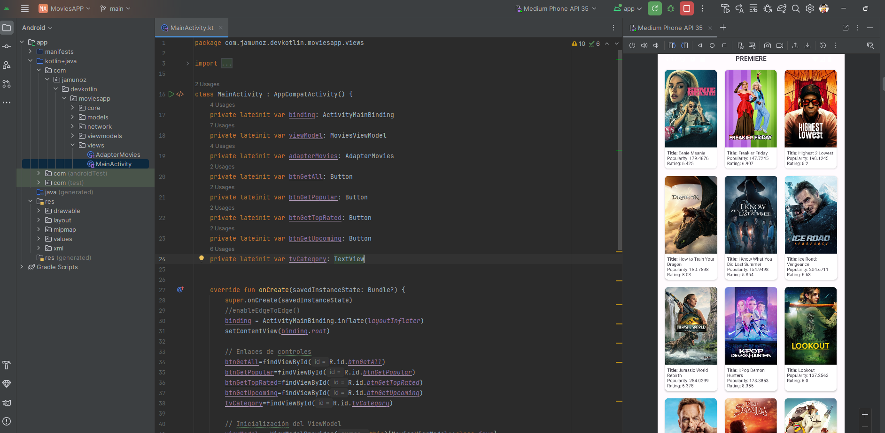

# MoviesAPP-Kotlin-XML
Proyecto KOTLIN con XML para visualizar información de peliculas de THEMOVIEDB.

Las tecnologías utilizadas son:

* XML Views
* Retrofit para consumo de API REST
* Glide para visualización de imágenes
* Patrón MVVM

